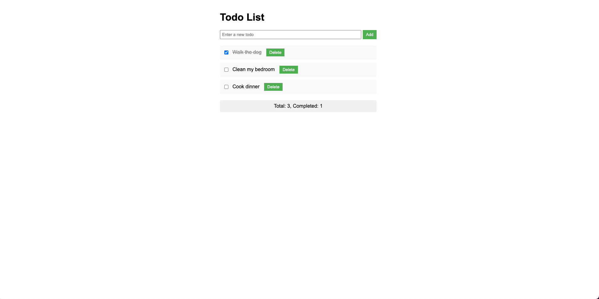

# Todo List Project

Welcome to the Todo List project! This exercise will help you practice your HTML, CSS, and JavaScript skills while also learning how to use Git and GitHub for version control.



## Project Preview Images

The application has different states represented by these preview images:

1. **Default View (Thumbnail)**
   
   - Shows the basic layout of the todo list
   - Displays the input form, todo items, and statistics

2. **Empty State**
   
   - Displayed when there are no todos
   - Shows a friendly message encouraging users to add their first todo

3. **Ordered Todos**
   
   - Shows how todos are displayed in order
   - Demonstrates completed and uncompleted todo items

## Project Setup

### 1. Create a GitHub Repository

1. Go to [GitHub](https://github.com) and sign in (or create an account if you don't have one).
2. Click the '+' icon in the top right corner and select "New repository".
3. Name your repository (e.g., "todo-list-project").
4. Choose to make it public or private.
5. Initialize with a README if you want (we'll create one locally in this guide).
6. Click "Create repository".

### 2. Clone the Repository Using GitKraken

1. Open GitKraken.
2. Click "File" > "Clone Repo".
3. Choose "GitHub.com" as the source.
4. Select the repository you just created.
5. Choose where to clone it on your local machine.
6. Click "Clone the repo!".

### 3. Project Structure

Create the following files in your local repository:

- `index.html`
- `styles.css`
- `script.js`
- `images/` directory containing:
   - `thumbnail.png` - Default view of the application
   - `empty.png` - Empty state display
   - `order.png` - Ordered todos display

## Development Process

Follow these steps to build your Todo List application:

### 1. Create the HTML Structure

Create the basic HTML structure for your todo list in `index.html`. Include:
- A form with an input field and a submit button for adding new todos
- An unordered list to display the todos
- A section for showing todo statistics
- An empty state message that shows when there are no todos

### 2. Style Your Application

Add CSS styles in `styles.css` to make your todo list visually appealing. Consider:
- The overall layout (centering, max-width)
- Styling for the form and input field
- Styles for todo items, including a completed state
- Styling for buttons (add, delete, complete)
- Empty state styling

### 3. Implement Add Todo Functionality

In `script.js`, write the JavaScript to allow adding new todos:
- Select necessary DOM elements
- Add an event listener to the form
- Create a function to add a new todo
- Update the DOM with the new todo
- Handle the empty state display

### 4. Implement Complete and Delete Functionality

Add the ability to mark todos as complete and delete them:
- Use event delegation on the todo list
- Implement functions to toggle completion and delete todos
- Update the DOM accordingly
- Show empty state when all todos are deleted

### 5. Implement Local Storage

Use localStorage to persist todos between page reloads:
- Save todos to localStorage whenever they change
- Load todos from localStorage when the page loads
- Render loaded todos on the page

### 6. Display Todo Statistics

Show the total number of todos and how many are completed:
- Create a function to calculate and update statistics
- Call this function whenever todos change

## Bonus Features

If you complete the basic requirements, try adding these features:

1. Filtering todos (all, active, completed)
2. Editing existing todos
3. Adding due dates to todos
4. Categorizing todos with tags or categories

## Git Workflow

As you work on your project, follow this Git workflow:

1. Create a new branch for each feature:
   ```
   git checkout -b feature/add-todo-form
   ```

2. Make your changes and test them.

3. Stage your changes:
   ```
   git add .
   ```

4. Commit your changes with a meaningful message:
   ```
   git commit -m "Add form for new todos"
   ```

5. Push your branch to GitHub:
   ```
   git push origin feature/add-todo-form
   ```

6. Create a pull request on GitHub to merge your feature branch into the main branch.

7. After reviewing, merge the pull request and delete the feature branch.

8. Pull the latest changes to your local main branch:
   ```
   git checkout main
   git pull origin main
   ```

## Tips

- Break down the project into small, manageable tasks.
- Commit your changes frequently.
- Use meaningful commit messages that describe what you've done.
- Test your application thoroughly as you develop.
- Don't be afraid to use online resources, but make sure you understand the code you're using.
- If you get stuck, refer to the SPOILERS.md file for hints, but try to solve problems on your own first.

## Submission

When you've completed the project:

1. Ensure all your changes are committed and pushed to GitHub.
2. Deploy your project to GitHub Pages or another hosting service.
3. Update this README with:
   - A brief description of your project
   - Any challenges you faced and how you overcame them
   - What you learned from this project
   - A link to the live demo of your application

Good luck, and happy coding!